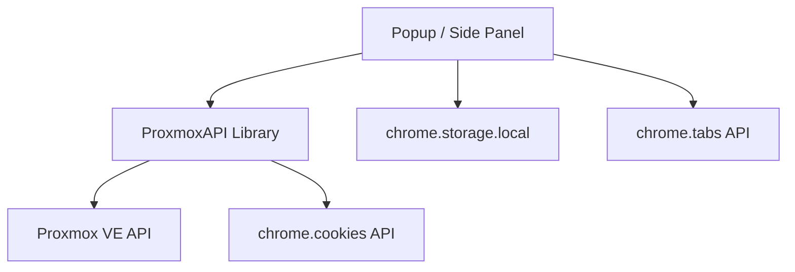

# PROXMUX Manager - Technical Architecture

This document describes the technical architecture and design patterns of the PROXMUX Manager Chrome Extension.

## 1. Overview
PROXMUX Manager is a Chrome Extension (Manifest V3) designed to manage Proxmox VE clusters. It follows a modular architecture separating API logic from the user interface.

## 2. Component Diagram

## 3. Core Components

### 3.1 ProxmoxAPI (`lib/proxmox-api.js`)
The heart of the extension. It encapsulates all communication with the Proxmox VE API.
- **Authentication**: Uses `PVEAPIToken` for all resource-related requests.
- **Session Management**: Specifically checks for the `PVEAuthCookie` using the `chrome.cookies` API to ensure interactive consoles (noVNC, Shell) can be opened without 401 errors.
- **Failover Logic**: Implements a retry mechanism that automatically switches to discovered cluster nodes if the primary node is unreachable.

### 3.2 UI Layer (`popup/`)
The extension uses a shared UI for both the browser action popup and the Chrome Side Panel.
- **`popup.html`**: Defines the searchable resource list and filter system.
- **`popup.js`**: Handles state management, filtering, and event delegation. It interacts with `ProxmoxAPI` to fetch data and launch consoles.
- **i18n**: Fully localized using `chrome.i18n` for English and German.

### 3.3 Data Storage
Uses `chrome.storage.local` to store:
- API Credentials (URL, Token, Secret).
- Failover Node URLs (discovered dynamically).
- User preferences (future).

## 4. Key Flows

### 4.1 Resource Loading & Failover
1. Extension triggers `api.getResources()`.
2. `ProxmoxAPI` tries the primary URL.
3. If it fails (Network Error), it iterates through `failoverUrls`.
4. On success, it updates the `currentUrl` for the current session and returns data.
5. `popup.js` then calls `updateFailoverNodes()` to keep the node list fresh.

### 4.2 Console Authorization
Before opening a `novnc` or `shell` URL, the extension:
1. Calls `api.checkSession()`.
2. Verifies the presence of `PVEAuthCookie` via `chrome.cookies.get`.
3. Performs a fallback `fetch` with `credentials: 'include'` to double-check.
4. If invalid, displays the **Login Required** overlay.

## 5. Security Model
- **Token Security**: API Tokens are stored locally in the browser's profile and are never transmitted to any third-party.
- **Least Privilege**: The extension requests only necessary permissions (`storage`, `tabs`, `downloads`, `sidePanel`, `cookies`).
- **Isolation**: All API calls are made from the local extension context.
